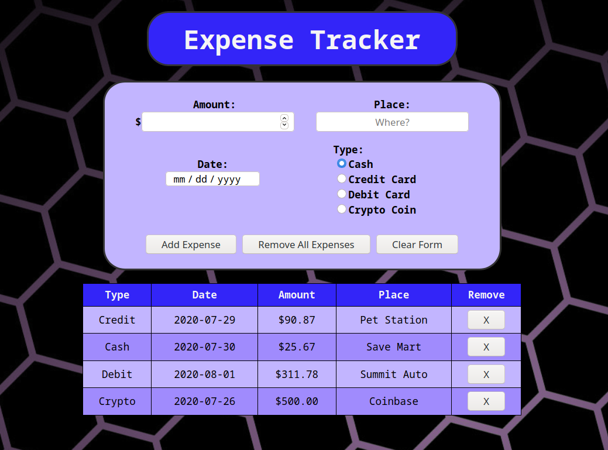

# Javascript Expense Tracker

> Expense Tracker app written in pure JS, HTML & CSS

  

Check out the app [here](https://bbastanza.github.io/Expense-Tracker-Javascript/)

## Summary

Building this app I learned more about using HTML tables to display things in a clear and organized way. I was able to work with HTML forms in this and get more comfortable with sending data back and forth from JS and HTML.

I learned a lot during this project. Doing this made me more comfortable using vanilla Javascript and really solidified a lot of the learning I had done up to this point. I know that the process of interacting with HTML through Javascript will be very valueable in the future while working on front end aspects of future, more challenging, applications.

#

## Author

### Brian Bastanza- Full Stack Web Developer

[Personal Website](www.brianbastanza.com)

[LinkedIn](www.linkedin.com/in/brian-bastanza-9035397b)
