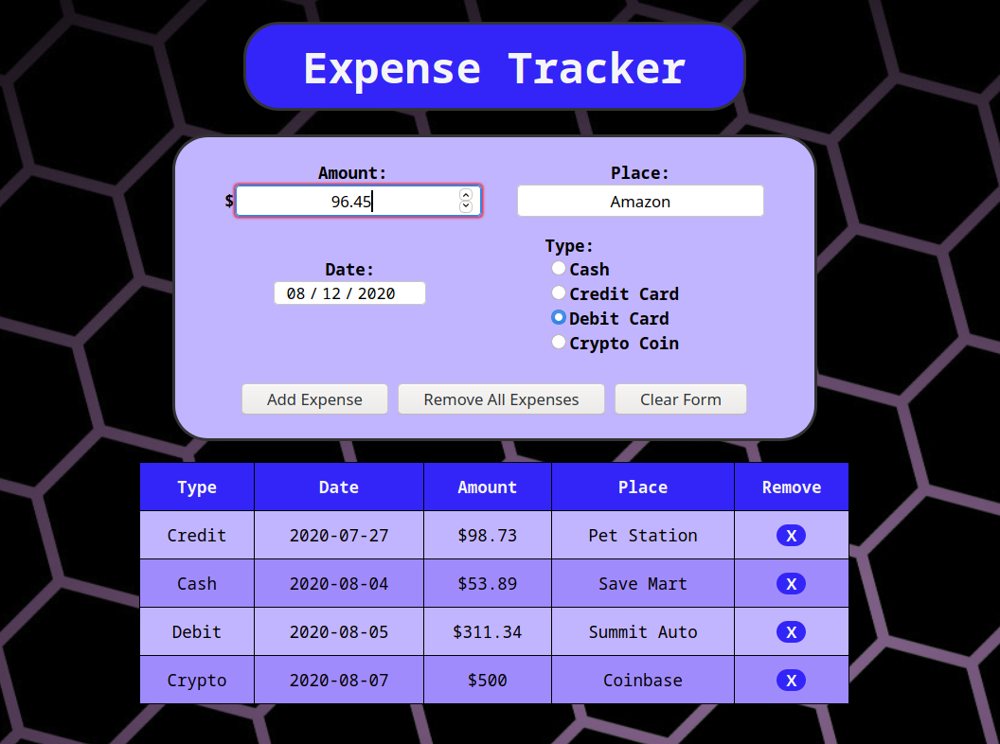

# Vanilla JS Expense Tracker

> Expense Tracker app written in pure JS, HTML & CSS

  

Check out the app [here](https://bbastanza.github.io/expense-vanilla/)

## Summary

I made this app to further my knowledge of JS, HTML and CSS.

Building this app I learned more about using forms in HTML to edit the DOM and how to edit HTML tables through javascript.

I learned a lot during this project and it really helped to cement some concepts I was previously working on while adding a few more minor concepts on top.

## Author

Brian Bastanza- Full Stack Web Developer
